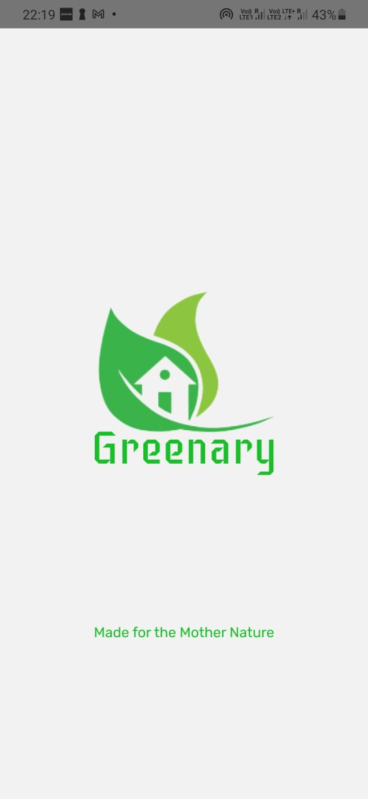

# Greenary

An app dedicated for the green earth. Frameworks used:

1. React Native: 
    The application was designed on Figma and converted into a working Mobile Application with the use of React Native. the-coding-machine boilerplate is used for the structural layout of this application.

2. Firebase Storage: 
    Firebase firestore is used to display the AQI of the application.

3. Google's Cloud Vision API:
    Google's Cloud Vision API is used to detect text out of images.

The demo of the application is attached as ScreenShots.
