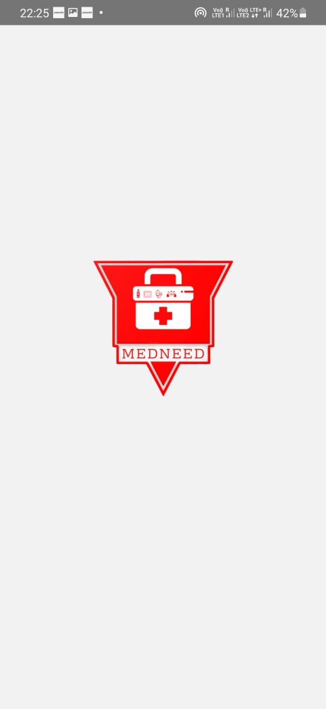

# Medneed

An app made for communities to share the essential commodities during a medical emergency. Frameworks used:

1. React Native: 
    The application was designed on Figma and converted into a working Mobile Application with the use of React Native. the-coding-machine boilerplate is used for the structural layout of this application.

2. Firebase Storage: 
    Firebase firestore is used to store users data, post data and other resources being displayed in the app.

3. Firebase Auth:
    Firebase Phone Auhentication is used to authenticate the user's before logging into the app for their credibility and reducing spams on the platform.

The demo of the application is attached as ScreenShots. you can also instll the Apk of the production app.
